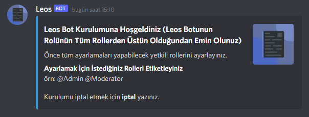
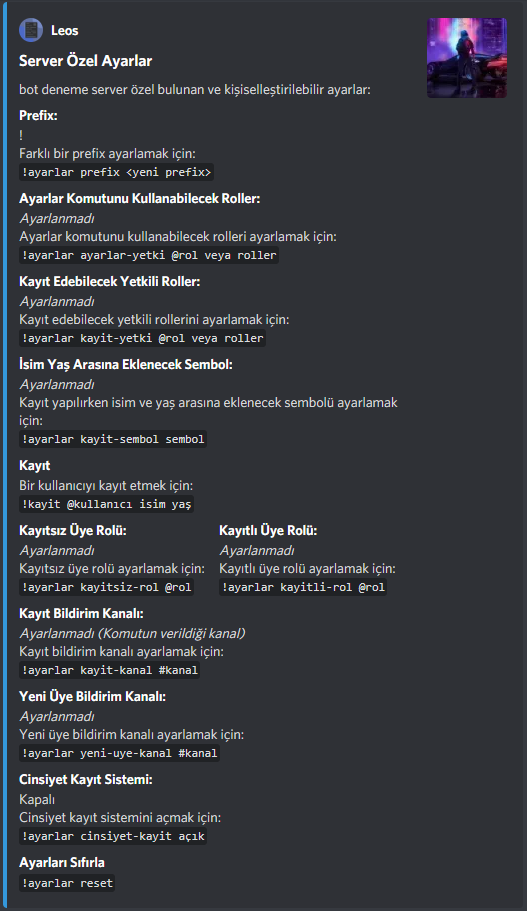
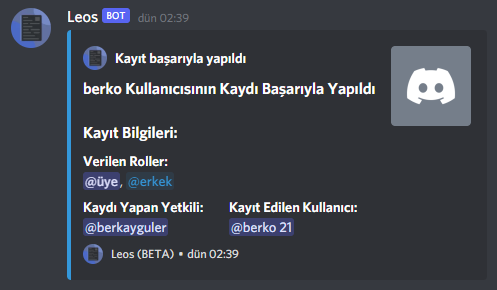
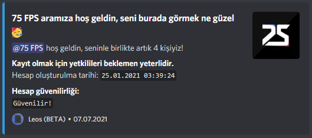

# Leos Discord Kayıt Botu
### Discord sunucunuzda yeni gelen üyelerinizi, güvenli bir şekilde Leos Bot arayıcılığı ile kayıt edin.


# **Nedir Bu Leos Kayıt Botu? Neden Sunucuma Eklemeliyim?**
Gün geçtikçe Discord yeni kullanıcılar kazanmaya devam ediyor. Bu kullanıcılar dilediği gibi yeni sunucular açıp dilediği gibi arkadaşlarıyla sohbet edip oyun oynayabiliyorlar. Tabi bu oluşturulan sunucular bir topluluk haline gelebiliyor ve çok fazla üye barındırabiliyor. Fazla üye barındıran sunucuları yönetmek bir hayli zor, sunucu yetkililerine çok fazla iş düşüyor. Leos Bot sayesinde yeni gelen kullanıcıları sunucunuzda ağırlayabilir, güvenli bir şekilde kayıt edebilir ve düzen sıkıntısı çekmeden eğlenmelerine vesile olabilirsiniz.

[Şimdi Sunucunuza Ekleyin](https://discord.com/api/oauth2/authorize?client_id=859748867490971698&permissions=8&scope=bot)

# **Dikkat!**
> Leos Bot'u sunucunuza eklediğiniz an Sunucu Ayarları kısmından Leos Bot'unun rolünü en üst rol olarak ayarlamayı unutmayın!

# **Kurulum**
Leos Bot'u sunucunuza eklediğinizde ilk yapacağınız işlem kurulum işlemidir. Aşağıda bulunan komut ile rahatlıkla Leos Bot'u sunucunuza kurabilirsiniz. Unutmayın kurulum işlemini sadece sunucu sahibi yapabilir!

```
!kurulum
```


# **Kurulum İşlemindeki Aşamalar**
* Tüm ayarlamaları yapabilecek yetkili roller ayarlanır.
* Kayıtları yapabilecek yetkili roller ayarlanır.
* Kayıt edilen üyenin isim ve yaş aralığına eklenecek sembol ayarlanır (İsteğe bağlıdır).
* Sunucuya katılan yeni üyeye verilecek olan kayıtsız üye rolü ayarlanır.
* Kayıt olan üyeye verilecek olan kayıtlı üye rolü ayarlanır.
* Bir üyenin kaydı tamamlandığında hangi kanalda bildirileceği ayarlanır.
* Sunucuya yeni bir üye katıldığında hangi kanalda bildirileceği ayarlanır.
* Cinsiyet Kayıt Sistemi'nin açık veya kapalı olacağı ayarlanır.
* Cinsiyet kayıt Sistemi açık olarak ayarlanırsa erkek ve kız üye rolleri ayarlanır.

# **Kurulum İşlemi Sonrası**
Kurulum işlemini başarılı bir şekilde tamamladıktan sonra aşağıda bulunan komutu kullanarak sunucu özel bulunan son ayarlarınızı takip edebilir ve tüm sunucu özel ayarlamalarınızı tekrardan yapabilirsiniz.

```
!ayarlar
```



# **Kayıt Sistemi Nasıl Çalışır? / Kullanılır?**
Eğer cinsiyete göre kayıt yapmak istemiyorsanız aşağıda bulunan komutu kullanarak yeni üyenizi başarılı bir şekilde kayıt edebilirsiniz (Unutmayın sadece kurulum esnasında ayarlamış olduğunuz kayıt edebilecek yetki rolüne sahip üyeler kayıt yapabilir).

```!kayit @kullanıcı isim yaş```

Eğer cinsiyete göre kayıt yapmak istiyorsanız aşağıda bulunan komutu kullanarak yeni üyenizi başarılı bir şekilde kayıt edebilirsiniz (Unutmayın sadece kurulum esnasında ayarlamış olduğunuz kayıt edebilecek yetki rolüne sahip üyeler kayıt yapabilir).

```
!kayit cinsiyet(erkek, kız) @kullanıcı isim yaş
```



# **Hoşgeldin Bildirimi**
Sunucunuza yeni bir üye katıldığında aşağıda bulunan fotoğraftaki gibi, kurulum işlemi aşamasında ayarladığınız Yeni Üye Bildirim Kanalı'nda yeni kullanıcının Discord'a katılım tarihine ve hesabın güvenilirliğine erişebilirsiniz (Discord'a 15 günden önce katılmış kullanıcıları şüpheli oalrak işaretler).



# **Geliştirici**
Berkay GÜLER
